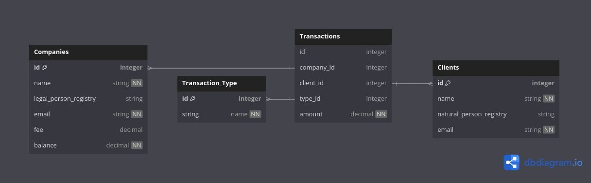

# Transaction TGID Demo
Este repositório contém uma aplicação REST que lida com usuários que podem ser empresas e clientes, 
dos quais clientes podem realizar saques e depósitos das empresas caso estas possuam
saldo para realizar as operações.

# Getting Started

### Rodando a Aplicação

Observação: é necessário ter uma instância de MySQL rodando na porta 3306, caso <br>
o seu sistema operacional seja Linux e tenha o docker-compose pelo menos na versão 3 <br>
pode usar o comando para instanciar uma imagem de MySQL na porta 3306 <br>
```bash
docker compose up -d
```


Clone este repositório e execute o comando para buildar e executar o app <br>

```bash
mvn clean install && java -jar target/transactionDemo-0.0.1-SNAPSHOT.jar
```


### Modelagem inicial das entidades:

Imagem criada no [DB diagram](https://dbdiagram.io)



<details><summary>Snippet das entidades</summary>

O snippet abaixo pode ser colado no [DB diagram](https://dbdiagram.io) e editado

```bash
Table Clients {
  id integer [pk]
  name string [not null]
  natural_person_registry string [unique]
  email string [not null]
}

Table Companies {
  id integer [pk]
  name string [not null]
  legal_person_registry string [unique]
  email string [not null]
  fee decimal [null]
  balance decimal [not null]
}

Table Transaction_Type {
  id integer [pk]
  string name [not null]
}

Table Transactions {
  id integer 
  company_id integer [ref: > Companies.id]
  client_id integer [ref: > Clients.id]
  type_id integer [ref: > Transaction_Type.id]
  amount decimal [not null]
}
```
</details>


# Endpoints Disponíveis

## Rota /clients

<details><summary> Expandir </summary>

#### GET

O método GET deste endpoint realiza a busca de um cliente por CPF (naturalRegistry) 
e espera um body no seguinte 
formato
```json
{ "naturalRegistry": "84439953867" }
```

E trará a resposta a seguir em caso de Sucesso com status 200:

```json
{
  "name": "ClientName",
  "email": "client@email.com",
  "naturalRegistry": "84439953867"
}
```

#### Casos de Erro:
* 400 - Caso o body não possua a chave "naturalRegistry" ou CPF fora do padrão de caracteres.
* 404 - O CPF passado não está cadastrado.
* 422 - O formato do CPF seja inválido.

----
#### POST

Já o post é responsável por realizar o cadastro de novos clientes e espera um body no seguinte 
formato
```json
{
  "name": "Newclient",
  "email": "newClient@valid.com",
  "naturalRegistry": "19690026038"
}
```

A resposta em caso de sucesso tem status 201:
```json
{
  "name": "Newclient",
  "email": "newClient@valid.com",
  "naturalRegistry": "19690026038"
}
```

#### Casos de Erro:
* 400 - Body não contenha uma propriedade, ou propriedade mal formatada
* 409 - Conflito de recurso, cliente com este CPF já cadastrado
* 422 - CPF inválido

</details>

------

## Rota /companies

<details><summary> Expandir </summary>

#### GET

O método GET deste endpoint realiza a busca de uma empresa por CNPJ (legalPersonRegistry)
e espera um body no seguinte
formato
```json
{ "legalRegistry": "18196534000109" }
```

E trará a resposta a seguir em caso de Sucesso com status 200:

```json
{
  "name": "F.I.R.S.T",
  "email": "first@email.com",
  "legalRegistry": "18196534000109"
}
```

#### Casos de Erro:
* 400 - Caso o body não possua a chave "legalRegistry" ou CNPJ fora do padrão de caracteres.
* 404 - O CNPJ passado não está cadastrado.
* 422 - O formato do CNPJ seja inválido.

----
#### POST

Já o post é responsável por realizar o cadastro de novas empresas e espera um body no seguinte
formato
```json
{
  "name": "someAcompany",
  "legalPersonRegistry": "27316685000136",
  "email": "some@company.email.com",
  "fee": 0.01,
  "balance": 10000
}
```

A resposta em caso de sucesso tem status 201:
```json
{
  "name": "somaAcompany",
  "email": "some@company.email.com",
  "legalRegistry": "27316685000136"
}
```

#### Casos de Erro:
* 400 - Body não contenha uma propriedade, ou propriedade mal formatada
* 409 - Conflito de recurso, empresa com este CNPJ já cadastrado
* 422 - CNPJ inválido

</details>

----

## Rota /transactions

<details><summary> Expandir </summary>

#### POST

transactions possui apenas o endpoint para cadastrar transações, e espera no corpo da requisição 
o seguinte body
```json
{
  "cnpj": 47959523000123,
  "cpf": 84439953867,
  "type": "withdraw",
  "amount": 15
}
```

A resposta em caso de sucesso tem status 201:
```json
{
  "companyName": "3ND",
  "clientName": "FClient",
  "operation": "withdraw",
  "amount": 15
}
```

Esse endpoint também atualiza o saldo disponível da empresa de acordo com a natureza da transaction
onde depósitos são acrescidos ao saldo, e saques subtraídos, valores estes que são modificados 
pela tarifa (única) pela coluna "fee" em valor decimal para representar a porcentagem a incidir 
sobre o montante da operação.

Em caso de depósitos o cálculo para atualizar o saldo é:<br>
novo_saldo = saldo_atual + amount * (1 - fee)
onde (1 - fee) representa o percentual da quantidade depositada a ser acrescentada ao novo_saldo
<br>EX: 
```bash
saldo_atual = 10
amount = 100 
fee = 0.01 (representando 1% de taxa)

o total a ser acrescido ao saldo após a transação será de 

amount * (1 - fee)
100 * (1 - 0.01)
100 * 0.99
novo_saldo = saldo_atual + 99
novo_saldo = 10 + 99
novo_saldo = 109
```


em caso de saques o cálculo é: <br>
novo_saldo = saldo_atual - amount * (1 + fee)
onde (1 + fee) representa o valor percentual a mais da quantidade sacada pelo cliente do saldo 
da empresa
<br>EX:
```bash
saldo_atual = 1000
amount = 100 
fee = 0.01 (representando 1% de taxa)

o total a ser subtraido do saldo após a transação será de 

amount * (1 + fee)
100 * (1 + 0.01)
100 * 1.01
novo_saldo = saldo_atual - 101
novo_saldo = 200 - 101
novo_saldo = 99
```


#### Casos de Erro:
* 400 - Body não contenha uma propriedade, ou propriedade mal formatada
* 404 - Empresa ou cliente não encontrado nos recursos para registrar a transaction
* 422 - CNPJ ou CPF inválido, ou fundos da empresa são insuficientes para a transaction

</details>

----

### TO-DOS e Decisões

A estrutura do projeto segue algumas convenções de MVC(Model, View e Controller)
o pacote Controller cuida de algumas verificações das requests e passa a adiante para 
validações mais lógicas ao pacote Service que vai interagir diretamente com o pacote de 
repositories e 
ser também responsável de lançar as exceções. o pacote advice é quem vai tratar das exceções 
lançadas e está presente nas controllers.

Os DTOs são responsáveis por remover algumas informações sensíveis da aplicação das camadas mais 
próximas dos usuários e também utilizei algumas validações por anotações com Beans nos DTOs 
que são responsáveis pela tipagem e serialização das request quando recebemos informações a 
serem transformadas em recursos.

Houve um disparo para o webHook mas infelizmente não consegui realizar a parte de notificação 
aos usuários (empresas e clientes).

### To-Dos [ Debts ]
- [ ] Dockerizar a aplicação.
- [ ] Refinar validações, utilizar mais de expressões regulares.
- [ ] Realizar Testes.
- [ ] Feature de notificação.
- [ ] Substituir o dialeto de MySQL para PostgresSQL na aplicação e configurações


### Depências do projeto
As depêndencias utilizadas neste repositório são:

* [Spring Web](https://docs.spring.io/spring-boot/docs/3.2.1/reference/htmlsingle/index.html#web)
* [Spring Data JPA](https://docs.spring.io/spring-data/jpa/reference/)
* [Spring Boot DevTools](https://docs.spring.io/spring-boot/docs/3.2.1/reference/htmlsingle/index.html#using.devtools)
* [Spring Boot Actuator](https://docs.spring.io/spring-boot/docs/3.2.1/reference/htmlsingle/index.html#actuator)

